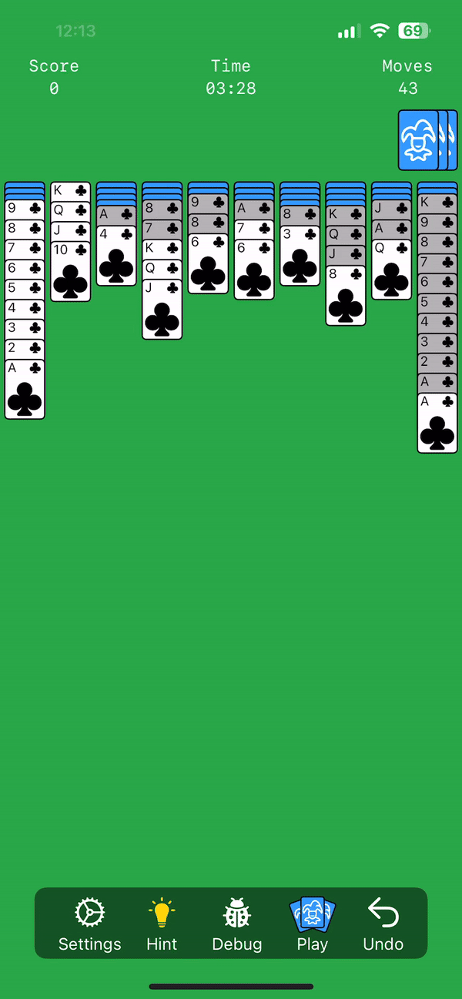

# Spider Solitaire

## Features

- [x] 🃏 Classic Spider Solitaire gameplay
- [x] 🌈 Smooth animations and intuitive drag-and-drop interface
- [x] 🔢 Multiple difficulty levels (1, 2, or 4 suits)
- [x] ⏱️ Time and move tracking
- [x] 💡 Hints
- [x] 👆 Tap to move
- [ ] 🏆 Score calculation
- [ ] 💾 Game state persistence
- [ ] 🌄 Landscape & macOS support
- [ ] 🎆 Win animation
- [ ] 🎨 Customizable card designs


## Screenshots

<table>
    <tr>
        <td width="30%">Start</td>
        <td width="30%">Card Movement</td>
        <td width="30%">Undo</td>
    </tr>
    <tr>
        <td width="30%"></td>
        <td width="30%"></td>
        <td width="30%"></td>
    </tr>
    <tr>
        <td width="30%">Draw</td>
        <td width="30%">Hint</td>
        <td width="30%">Complete Set</td>
    </tr>
    <tr>
        <td width="30%"></td>
        <td width="30%"></td>
        <td width="30%"></td>
    </tr>
</table>

## Requirements

- iOS 18.0+/macOS 14.0+
- Xcode 16.0+
- Swift 6

Installation

1. Clone the repository:
```bash
git clone https://github.com/mazjap/spider-solitaire.git
```

2. Open the project in Xcode:
```bash
cd spider-solitaire
open SpiderSolitaire.xcodeproj
```

3. Build and run the project in Xcode.

## How to Play

1. Choose your difficulty level: 1 suit (Easiest), 2 suits (Medium), or 4 suits (Hard).
2. Drag cards to build descending sequences of the same suit.
3. Complete a sequence from King to Ace to remove it from the table.
4. Use the draw pile to add new cards when you're stuck.
5. Clear all cards from the table to win!

## Architecture

This project follows the MVVM (Model-View-ViewModel) architecture and utilizes SwiftUI's latest features:

- GameView: Main view containing the game board
- CardView: Custom view for rendering individual cards
- CardStackView: Manages stacks of cards in columns
- GameViewModel: Handles game logic and state management
- GameState: Represents the current state of the game

## Contributing

Contributions are welcome! Please feel free to submit a Pull Request.

## License

This project is licensed under the MIT License - see [the LICENSE file](./LICENSE) for details.
